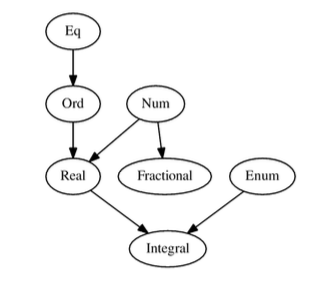

# Chapter 6. Less Ad-Hoc Polymorphism

## Typeclass inheritance
When typeclass has a superclass, we use `=>` to dedicate it.
```haskell
class Num a => Fractional a where
	(/) :: a -> a -> a
	recip :: a -> a
	...
```

## Instances
We can make specific type which is an `instance` of some typeclass.
With instance, we can define how a typeclass should work for a given type.
```haskell
data DayOfWeek = Mon | Tue | Wed | Thu | Fri | Sat | Sun
instance Eq DayOfWeek where
  (==) Mon Mon = True
  (==) Tue Tue = True
  (==) Wed Wed = True
  (==) Thu Thu = True
  (==) Fri Fri = True
  (==) Sat Sat = True
  (==) Sun Sun = True
  (==) _ _     = False 
```
If we want to get characteristics of other typeclass but not specifying it, we can use `deriving`.
```haskell
data DayOfWeek = Mon | Tue | Wed | Thu | Fri | Sat | Sun deriving (Ord)
```

## Effects
Effects are how we refer to observable actions programs may take other than compute a value, and if the function does cause effects, it's called that it has **side effects**.

## Typeclass Hierarchy
